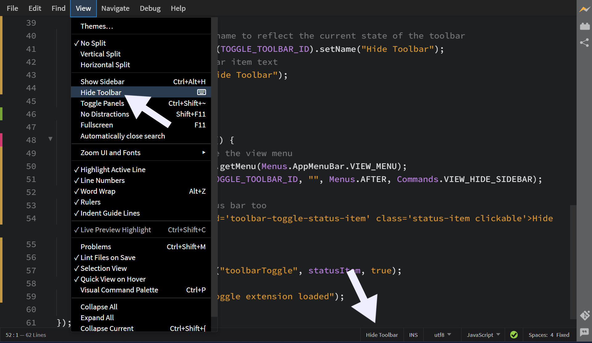
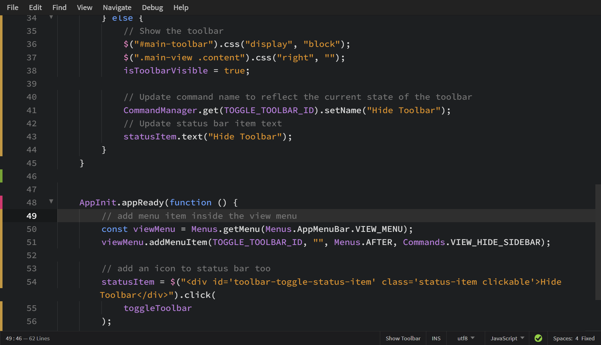

# Hide Toolbar Extension for Phoenix Code

A simple extension to hide or show the toolbar in Phoenix Code.

## How to Use

1. After installing this extension, you'll see a **Hide Toolbar** button in the status bar. Click it, and the toolbar disappears. Click again, and it comes back. Simple.

   

2. You can also use the menu bar: **View > Hide Toolbar**.

   

That's it! 🚀
